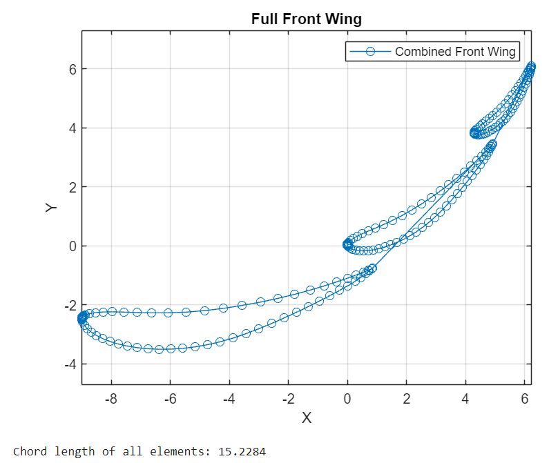
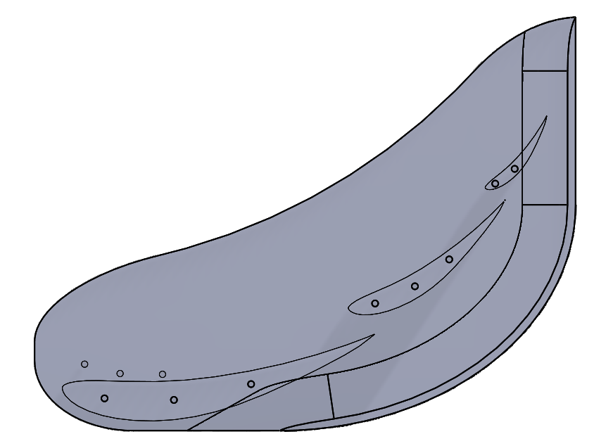
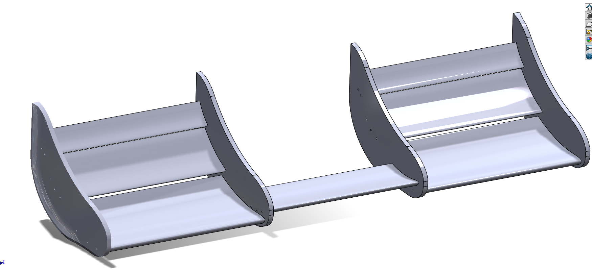

# FSAE Front Wing Generator
This is a Matlab script that can create a 2D side view of the front wing for an FSAE car (small F1-style racing cars) 

## Images
### Pre-CAD (Matlab)

### Post-CAD (Solidworks)

## Why?

This allows the user to modify and adjust values (Angle of attack, scale, position) before throwing it into CAD Design software. Ensures consistency of position, sizing, and rotation during the CAD process.

## How does it work?

1.  Download AirfoilWingEditor.mlx, AirfoilModifier.m, E423_Airfoil.txt, and empty.txt
    - Work in AirfoilWingEditor.mlx 
    - Download [ ].txt files to prevent errors on startup
2.  Pick an airfoil of choice from an airfoil database (example file is airfoil E423)
    -  Download its DAT file (coordinates) into a .txt file
    -  Rename it conventionally 
    -  Put it into the same folder as the .mlx and .m files.
3. Adjust airfoilCount to the number of elements you are using
4.  Adjust each value for each element to your preferences
    - Input file name
    - Output file name
    - Angle of attack (rotation)
    - Scale (size)
    - X-axis translation    
    - Y-axis translation
    - Flip airfoil
    - Need y column
    - Export
    - Plot
5. Run the .mlx file
6. Will write n files with the coordinates of each element in the folder (...\fsae-front-wing-generator\\[...])
